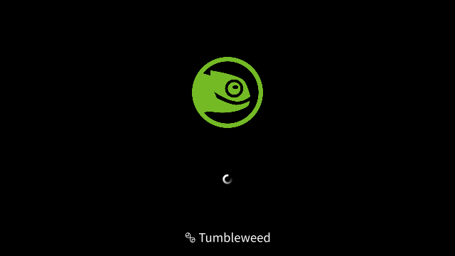
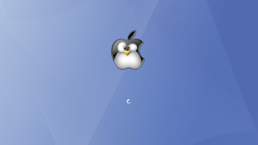

# Plymouth Theme Hacks

Nice replacement pictures for the Plymouth bgrt-fallback and background-tile images.

## Screenshots

&#160;

## Prerequisites

You will need to have **plymouth** and **plymouth-themes** already installed.

The directory **/usr/share/plymouth/themes/** must include **bgrt** and **spinner**.

You will also need to be able to get **root** permissions with **sudo**.

&#160;

## Installation

### BGRT Fallback Hacks
1. sudo cp ***< logo >*** /usr/share/plymouth/themes/spinner/bgrt-fallback.png
2. sudo plymouth-set-default-theme -R bgrt

### Background Tile Hacks
1. sudo cp ***< tile >*** /usr/share/plymouth/themes/spinner/background-tile.png
2. sudo plymouth-set-default-theme -R spinner

&#160;

## Links
* [Arch Linux Wiki - Plymouth](https://wiki.archlinux.org/title/Plymouth)
* [Fedora Project Wiki - Better Startup](https://fedoraproject.org/wiki/Features/BetterStartup)
* [Gentoo Linux - Plymouth/Theme creation](https://wiki.gentoo.org/wiki/Plymouth/Theme_creation)
